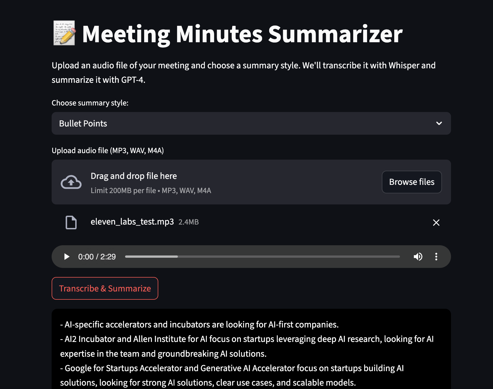

# 📝 Meeting Minutes Summarizer

Ahe **Meeting Minutes Summarizer** is a lightweight web app built with Streamlit that allows users to upload an audio recording (MP3, WAV, or M4A) of a meeting, transcribe it using OpenAI's Whisper model, and generate a high-quality summary using GPT-4. The final summary can be downloaded in either `.txt` or `.pdf` format.


Upload an `.mp3`, `.wav`, or `.m4a` file, choose a summary style, and download the results in `.txt` or `.pdf`.

👉 **Try it live:** [https://meeting-minutes-summarizer-ksg3vwf9y9uey9hgj8pw9m.streamlit.app/](https://meeting-minutes-summarizer-ksg3vwf9y9uey9hgj8pw9m.streamlit.app/)

---

## 📷 Screenshots

### Home Page  


---

## 💡 Features

- 🎙 Upload your audio recording
- 🧠 Auto-transcribe with OpenAI Whisper
- ✍️ Summarize with GPT-4 (Executive / Bullet / Email styles)
- 💾 Download as `.txt` or `.pdf`
- 🎧 In-browser audio preview

---

## 🚀 Tech Stack

- **Frontend / UI Framework:** [Streamlit](https://streamlit.io/)
- **Language:** Python 3.10+
- **Transcription Engine:** [OpenAI Whisper API](https://platform.openai.com/docs/guides/speech-to-text)
- **Summarization Model:** [OpenAI GPT-4](https://platform.openai.com/docs/guides/gpt)
- **PDF Generation:** [FPDF](https://py-pdf.github.io/fpdf2/)
- **Deployment:** [Streamlit Community Cloud](https://streamlit.io/cloud)
- **Version Control:** Git & GitHub

---

## Acknowledgments

This project was made possible using the following open-source and cloud technologies:

OpenAI Whisper
OpenAI GPT-4
Streamlit
FPDF for Python
Python

Special thanks to the open-source community and Streamlit Cloud for providing a free hosting platform.

---

## 🧪 Local Setup

```bash
git clone https://github.com/haystackz12/meeting-minutes-summarizer.git
cd meeting-minutes-summarizer
python -m venv venv
source venv/bin/activate        # Windows: venv\Scripts\activate
pip install -r requirements.txt
streamlit run app.py
